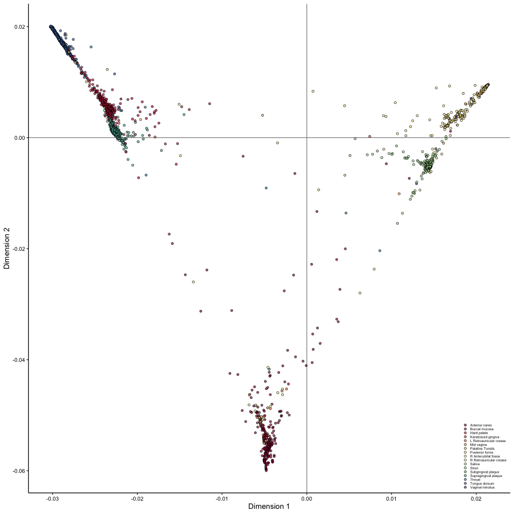

# Diffusion map
#### A test inspired by the recent paper by [Barter and Gross, 2019](https://royalsocietypublishing.org/doi/full/10.1098/rspa.2018.0615)
Contains R scripts that recreate diffusion map using a subset of the [Human Microbiome Project 2](https://portal.hmpdacc.org/) metagenomic species-level characterization. Species were quantified using the marker gene-based [MetaPhlAn2](https://bitbucket.org/biobakery/metaphlan2) software.

#### Example

```R
##
## let's make a quick script for the
## diffusion mapping process
## - AK Fahimipour
##
setwd('path/to/directory')

## load functions we'll need
source('./R/accessory_functions.R')

##
## load data
##
# load the mapping file from the human microbiome project
meta <- read.csv('./data/hmp_map.csv', header = T, row.names = 1, colClasses = 'character')

## load hmp species-level feature array
m <- read.csv('./data/hmp_species.csv', header = T, row.names = 1)

## drop samples that are identical, or else affinity matrix will contain Inf
m <- m[!duplicated(m), ]

##
## diffusion map process starts here
##
## calculate similarities
st.1 <- Sys.time()
eucl <- m %>%
  norm.mat() %>%
  get.euc(., n.threads = 1)
Sys.time() - st.1

##
## NOTE: m is a sample x feature array
##
## get the normalized laplacian from the feature table
st.2 <- Sys.time()
Lij <- eucl %>%
  threshold(., top_k = 10) %>%                        ## threshold the distance matrix
  get.laplac()                                        ## calculate normalized laplacian
Sys.time() - st.2

## calculate eigenvals/vecs
st.3 <- Sys.time()
eig <- Lij %>% eigen()
Sys.time() - st.3

## get eigenvalues
evl <- eig %$%
  values %>%
  round(., 8)

## get eigenvectors
evc <- eig %$%
  vectors %>%
  round(., 8)

## how many eigenvectors do you want to extract?
neig <- 32
neig <- neig + 1

## get eigenvectors for neig smallest non-zero eigenvalues
for(d in 1:neig){
  
  ## assign the right eigenvector to the dim name
  assign(paste('dim', d, sep = '.'), Re(evc[, rank(evl, ties.method = 'random') == (d + 1)]))
  
}

## merge in array
dims <- do.call(mapply, c(FUN = cbind, mget(paste0("dim.", 1:(neig - 1))))) %>%
  t() %>%
  as.data.frame()

## add labels
colnames(dims) <- paste(paste('dim', 1:(neig - 1), sep = '.'))
rownames(dims) <- rownames(Lij)

## append metadata
dims <- cbind(meta[rownames(dims), ], dims)

## clean labels
dims$env_1 <- gsub('_', ' ', dims$env_1)

##
## plot
##
ggplot(dims, aes(x = dim.1, y = dim.2, fill = env_2)) +
  theme_classic() +
  xlab('Dimension 1') +
  ylab('Dimension 2') +
  geom_hline(yintercept = 0, linetype = 1, size = 0.5, colour = '#959595') +
  geom_vline(xintercept = 0, linetype = 1, size = 0.5, colour = '#959595') +
  geom_point(shape = 21, alpha = 0.65, size = 1.2) +
  scale_fill_manual(values = 
                      colorRampPalette(
                        brewer.pal(n = 11, name = 'Spectral'))(
                          length(
                            unique(
                              dims$env_2))), 
                    name = NULL) +
  theme(axis.title = element_text(size = 11, colour = '#000000'),
        axis.text = element_text(size = 8, colour = '#000000'),
        legend.position = c(1, 0),
        legend.background = element_blank(),
        legend.justification = c(1, 0),
        legend.key.width = unit(0.2, 'cm'),
        legend.key.height = unit(0.2, 'cm'), 
        legend.text = element_text(size = 5),
        legend.text.align = 0,
        legend.title = element_text(size = 9))

```

The eigenvectors corresponding to the 2 smallest non-zero eigenvalues provide new coordinates with which to visualize differences between HMP sample. This shows that the HMP metagenomes lie near a low dimensional manifold, and are roughly ordered from oral, to skin, gut, and urogenital microbial communities in terms of taxonomic profiles.





